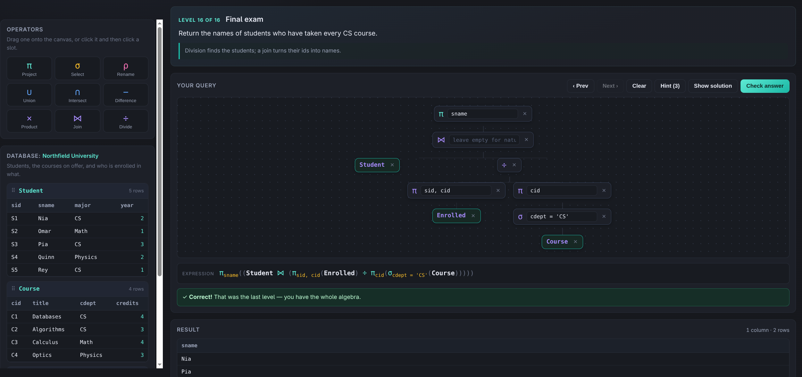

# Relational Algebra Playground



<sub>Solving the division puzzle: every student who has taken every CS course.</sub>

An interactive game for learning relational algebra. You are shown a set of relations and asked a
question in English; you answer by dragging operator symbols (π, σ, ρ, ∪, ∩, −, ×, ⋈, ÷) onto a
canvas to build a query tree. The query is evaluated for real against the data as you build it, and
checked against the expected answer.

## Running it

Open `index.html` in a browser — double-click it, or:

    xdg-open index.html

`index.html` is fully self-contained (CSS and JS inlined, no external requests), so it also works
from a USB stick, over a file share, or in a sandboxed browser. If your browser is installed via
Flatpak or Snap, opening a file through the desktop portal grants access to *that one file only* —
which is why a page split across `styles.css` and `js/*.js` renders unstyled and inert there. The
single file sidesteps that entirely.

Serving it over HTTP also works, and is the other way around a sandboxed browser:

    npm run serve                # then visit http://localhost:8080

## How the game works

- **Build by dragging.** Drag a relation or an operator from the left panel into a slot on the
  canvas. Clicking a chip and then clicking a slot works too (handy on touch screens).
- **Dropping onto a filled node wraps it**, so you can build a query outside-in or inside-out.
- **Deleting an operator promotes its first input**, so you can peel layers off without starting over.
- **Operator parameters** are typed inline: the attribute list for π, the condition for σ, the new
  name for ρ, an optional theta condition for ⋈.
- The **expression** line shows the query in standard notation, and the **result** table updates on
  every keystroke, including a plain-English error when the query does not typecheck.
- **Check answer** compares your result to the expected relation. Column order does not matter
  (relations are unordered sets of attributes); the rename level additionally checks column names.
- **Type it instead, if you prefer.** The *Type it* box under the canvas accepts standard notation,
  and the two stay in sync: typing rebuilds the tree, dragging rewrites the text. See
  [Typing expressions](#typing-expressions).
- **Every level is open from the start.** Nothing has to be unlocked — click any level in the bar at
  the top and go straight to it. Collapse that bar with the **Levels** header when you want the room;
  it remembers whether you left it open.
- Solving a level without hints earns ★; solving it after a hint or the solution earns ✓. Progress
  is kept in `localStorage`.

## The levels

Twenty-five puzzles in five chapters:

| Chapter | Levels | What it teaches |
| --- | --- | --- |
| Basics | 1–6 | a bare relation, π, σ, compound conditions |
| Set operations | 7–10 | ρ, ∪, −, ∩ and union compatibility |
| Joins | 11–13 | natural joins across three relations, filtering around them |
| Products and division | 14–16 | ρ + × to compare a relation with itself, ÷ for "for all" |
| Advanced | 17–25 | theta joins, self-joins for "at least two" and "exactly one", max without aggregation, "only", division by a derived relation, universal quantification by double negation |

| Aggregation | 26–32 | `ℱ` with and without grouping, several functions at once, filtering groups (SQL's HAVING), aggregating a join |

The advanced chapter is where relational algebra stops being a notation for SQL and starts being a
logic: with no aggregation and no counting, `MAX` becomes "nobody beats me", `only` becomes "has no
counterexample", and `for all` becomes either ÷ or a difference of two differences.

## Typing expressions

Anything you can drag, you can type — the text box and the canvas edit one tree, so switching
between them mid-query is fine. Unfilled slots show up as `?`.

### Tab completion

You never have to find the Greek keys. Type a few letters and press <kbd>Tab</kbd>:

| You type | Tab gives you |
| --- | --- |
| `proj` | `π_{}()` with the cursor between the braces |
| `sel` | `σ_{}()` |
| `ren` | `ρ_{}()` |
| `un`, `int`, `min`, `prod`, `div`, `join` | `∪ ∩ − × ÷ ⋈` |
| `group` | `ℱ_{}()` |
| `cou`, `su`, `av` … *inside* `{}` | `COUNT()`, `SUM()`, `AVG()` |

The menu knows where the cursor is: **inside** `{}` it offers attribute names, **outside** it offers
relation names and operators. With no menu open, <kbd>Tab</kbd> jumps to the next empty spot in the
expression, so the whole of level 2 is:

    proj ⇥ ena ⇥ ⇥ Emp ⇥          →  π_{ename}(Employee)

<kbd>↑</kbd>/<kbd>↓</kbd> move through the menu, <kbd>Esc</kbd> dismisses it, <kbd>Enter</kbd>
checks your answer. Typing a `)` or `}` that is already there steps over it rather than doubling it,
and a half-finished snippet such as `π_{}()` still draws on the canvas — the empty parentheses are
an unfilled slot, exactly like `?`. Syntax errors stay quiet until you stop typing.

    π_{ename}(σ_{salary > 60000}(Employee))
    π_{ename, pname}((Employee ⋈ WorksOn) ⋈ Project)
    Department ⋈_{head = eid} Employee

Every operator has an ASCII spelling, so no Greek keyboard is needed:

| Operator | Symbol | Also accepted |
| --- | --- | --- |
| project | `π` | `project`, `pi` |
| select | `σ` | `select`, `sigma` |
| rename | `ρ` | `rename`, `rho` |
| union | `∪` | `union` |
| intersect | `∩` | `intersect` |
| difference | `−` | `-`, `minus`, `difference`, `except` |
| product | `×` | `*`, `product`, `times`, `cross` |
| join | `⋈` | `join`, `\|><\|`, `\|x\|` |
| divide | `÷` | `/`, `divide` |
| aggregate | `ℱ` | `F`, `group`, `aggregate` |

Parameters go in `_{...}`, `{...}` or `[...]`; the bare form `π_ename(R)` works too, but a condition
containing parentheses needs the braces. Binary operators bind tighter for `× ⋈ ÷` than for
`∪ ∩ −`, and everything is left-associative — the canvas always shows exactly how your text was
grouped, which is the quickest way to check you meant what you wrote.

## Colors

The interface uses Lafayette College's palette: PMS 202 maroon `#822433` with the web palette's
`#65001C`, `#910029`, light blue `#4EA8D8`, warm gray `#A2998B` and pale gray `#E8E6E2`. On the dark
ground the brand maroon is too dark to read as text, so `--accent` is a tint of it and the solid
maroons are used as fills behind white. All of it lives in the `:root` block of `src/styles.css`.

## Aggregation

`ℱ` is written with the grouping attributes on its **left** and the function list on its **right**,
following Elmasri & Navathe:

    dept ℱ_{COUNT(eid), AVG(salary)}(Employee)     one row per department
    ℱ_{MIN(salary), MAX(salary)}(Employee)         no grouping: one row for everything

`COUNT`, `SUM`, `AVG` (or `AVERAGE`), `MIN` and `MAX` are available, and `COUNT(*)` counts rows.
Output columns are named after the call — `COUNT(eid)` becomes `COUNT_eid`, and `COUNT(*)` becomes
`COUNT` — so they are ordinary attributes afterwards, which is how you filter groups:

    π_{dept}(σ_{COUNT_eid > 2}(dept ℱ_{COUNT(eid)}(Employee)))

That is the relational-algebra spelling of SQL's `HAVING`. Note that groups are built only from rows
that exist: a course nobody is enrolled in contributes no rows to `Enrolled`, so it has no group and
never appears in the result.

## Conditions

`salary > 60000`, `dept = 'Sales'`, `A.eid < B.eid`, combined with `AND` / `OR` / `NOT` and
parentheses. The symbols `∧ ∨ ¬ && || !` work too. Text values must be quoted. Comparisons are
`= <> != < <= > >=`.

## Layout

Edit the files in `src/`, then run `npm run build` to regenerate `index.html`.

    index.html               BUILT — do not edit by hand; regenerate with `npm run build`
    build.js                 inlines src/ into the single-file index.html
    src/index.template.html  markup, with placeholders for the inlined CSS and JS
    src/styles.css           all styling
    src/engine.js            relational algebra engine: relations, operators, condition parser, checking
    src/levels.js            the two databases and the 25 puzzles (each solution is an expression tree)
    src/app.js               UI: drag and drop, tree editing, live evaluation, progress
    test/smoke.js            end-to-end test that drives the real UI in jsdom

## Tests

    npm install      # jsdom, for the smoke test only — the game itself has no dependencies
    npm test         # builds, then drives the built index.html

The smoke test boots the page, places nodes by click and by drop, checks a wrong answer and a
broken condition, then solves all 25 levels through the UI and asserts there are no console errors.
Point it at any copy of the built file to prove that copy stands alone:

    node test/smoke.js /some/other/place/index.html

## Adding a level

Append to `LEVELS` in `src/levels.js`, then `npm run build`. Solutions are expression trees built with the `rel()` and
`op()` helpers, e.g.

```js
{
  db: 'company',
  title: 'Filter, then project',
  question: 'Return the names of employees who earn more than 60000.',
  focus: ['project'],              // marks the operator "new" in the palette
  chapter: 'Basics',               // optional: starts a new row in the level bar
  tip: 'Shown under the question.',
  hints: ['Revealed one at a time.'],
  checkNames: true,                // optional: require exact column names
  solution: op('project', 'ename', [op('select', 'salary > 60000', [rel('Employee')])])
}
```

The expected answer is computed by running that tree through the engine, so a level can never drift
out of sync with its own solution.
